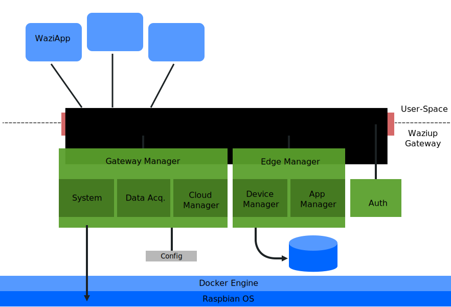
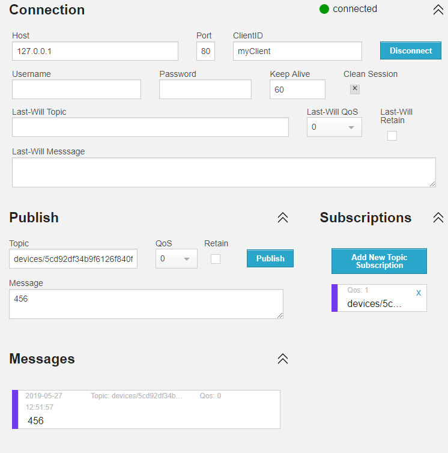

# Waziup Edge Server *for Waziup Gateway*

The edge server provides basic endpoints do retrieve, upload and change device, sensor and actuator data.

You can use REST and MQTT on all endpoints.




# Table of Contents

* [Usage](#usage)
* [Development](#development)
* [Examples](#examples)
  * [create a new device](#create-a-new-device)
  * [change a device name](#change-a-device-name)
  * [delete a device](#delete-a-device)
  * [list all devices](#list-all-devices)
  * [create a new sensor or actuator](#create-a-new-sensor-or-actuator)
  * [change a sensor or actuator name](#change-a-sensor-or-actuator-name)
  * [list all sensors or actuators](#create-a-new-device)
  * [delete a sensor or actuator](#delete-a-sensor-or-actuator)
  * [upload a sensor or actuator value](#upload-a-sensor-or-actuator-value)
  * [upload multiple sensor or actuator values](#upload-multiple-sensor-or-actuator-values)
  * [get-the-last-sensor-or-actuator-value](#get the last sensor or actuator value)
* Clouds and Synchronization
  * [add a Waziup Cloud for synchronization](#add-a-waziup-cloud-for-synchronization)
  * [list all configured clouds](#list-all-configured-clouds)
  * [pause & resume cloud synchronization](#pause--resume-cloud-synchronization)
  * [change cloud credentials (username and password)](#change-cloud-credentials-username-and-password)
  * [change the cloud url (rest or mqtt)](#change-the-cloud-url)
* [Use MQTT!](#use-mqtt)
* [System Settings](#system-settings)
  * [Log Files](#log-files)
* [Configuration](#configuration)


# Usage

This project is part of the [Waziup Open Innovation Platform](https://www.waziup.eu/). In most cases you do not want to use this repository without the
waziup platform, so have a look the [**Waziup Gateway**](https://github.com/Waziup/waziup-gateway) at [github.com/Waziup/waziup-gateway](https://github.com/Waziup/waziup-gateway).


# Development

## with go (golang) from source

You can compile this project from source with golang and git.
Grab yourself the go language from [golang.org](https://golang.org/) and the
git command line tools with `apt-get git` or from [git-scm.com/download](https://git-scm.com/download).

Now build the wazigate-edge executable:

```bash
git clone https://github.com/Waziup/wazigate-edge.git
cd wazigate-edge
go build .
```

And run the wazigate-edge server with:


```bash
wazigate-edge
```

## with docker

If you like to use docker you can use the public waziup docker containers at [the Docker Hub](https://hub.docker.com/u/waziup/).
For development you can build this repo on your own using:

```bash
git clone https://github.com/Waziup/wazigate-edge.git
cd wazigate-edge
docker build --tag=wazigate-edge .
docker run -p 4000:80 wazigate-edge
```

# Examples

... with JavaScript and [fetch](https://developer.mozilla.org/en-US/docs/Web/API/Fetch_API/Using_Fetch).

### create a new device

```javascript
var resp = await fetch("/devices", {
    method: "POST",
    headers: {
		'Content-Type': 'application/json'
	},
    body: JSON.stringify({
        // id: "5cde6d034b9f61" // let the server choose an id
        name: "My Device 1",    // readable device name
        sensors: [{             // sensors list:
			id: "6f840f0b1",       // sensor id (hardware id)
			name: "My Sensor 1",   // readable name
        }, {
			id: "df34b9f612",
			name: "My Sensor 2",
        }],
        actuators: [{           // actuators list:
			id: "40f034",
			name: "My Actuator 1",
        }],
    })
});
// the device id will be returned
var deviceId = await resp.json();
alert(`new device.id: ${deviceId}`);
```

Console output will be like:
```
new device.id: 5cde6d034b9f610ff8373bdb
```

### change a device name

```javascript
var deviceId = "5cde6d034b9f610ff8373bdb";
await fetch(`/devices/${deviceId}/name`, {
    method: "POST",
    headers: {
		'Content-Type': 'application/json'
	},
    body: JSON.stringify("New Device Name")
});
```

### delete a device

```javascript
var deviceId = "5cde6d034b9f610ff8373bdb";
fetch(`/devices/${deviceId}`, {
    method: "DELETE",
});
```

### list all devices

```javascript
var resp = await fetch("/devices");
var devices = await resp.json();
console.log(devices);
```

Console output will be like: (without comments)

```javascript
[{
  name: "My Device 1",
  id: "5cde6d034b9f61",
  // Sensors List
  sensors: [{
    // unique sensor id
    id: "6f840f0b1",
    // Sensor name
    name: "My Sensor 1",
    // time when last modified
    modified: "2019-06-03T12:31:34.331Z",
    // time when created
    created: "2019-06-03T12:31:34.331Z",
    // time last value received
    time: "2019-06-03T12:15:47.971Z",
    // last value
    value: null
  },{
    id: "df34b9f612",
    name: "My Sensor 2",
    modified: "0001-01-01T00:00:00Z",
    created: "2019-06-03T12:31:34.331Z",
    time: "2019-06-03T12:15:47.971Z",
    value: null
  }],
  // Actuators List
  actuators: [{
    id: "40f034",
    name: "My Actuator 1",
    modified: "2019-06-03T12:30:52.106Z",
    created: "2019-06-03T12:31:34.331Z",
    time: "2019-06-03T12:15:47.971Z",
    value: null
  }],
  modified: "2019-06-03T12:30:52.106Z",
  created: "2019-06-03T12:31:34.331Z"
}]
```

* Modified-times for devices get updated when the device name changes (using POST .../name) but not if a new sensor or actuator gets added or deleted.
* Modified-times on sensors or actuators get updated when the sensor or actuator name changes, but not if a new value gets posted.
* Time and Value for each sensor are the same as at GET .../value

### create a new sensor *or actuator*

```javascript
var deviceId = "5cde6d034b9f610ff8373bdb";
await fetch(`/devices/${deviceId}/sensors`, {
    method: "POST",
    headers: {
		'Content-Type': 'application/json'
	},
    body: JSON.stringify({
        id: "0ff8373bd",       // sensor id (hardware id)
        name: "My Sensor 3",   // readable name
    })
});
```

The same goes for actuators. Just replace `sensors` with `actuators`.

### change a sensor *or actuator* name

```javascript
var sensorId = "0ff8373bd";
var deviceId = "5cde6d034b9f610ff8373bdb";
await fetch(`/devices/${deviceId}/sensors/${sensorId}/name`, {
    method: "POST",
    headers: {
		'Content-Type': 'application/json'
	},
    body: JSON.stringify("New Sensor Name")
});
```

### list all sensors *or actuators*

```javascript
var deviceId = "5cde6c194b9f610ff8373bda";
var resp = await fetch(`/devices/${deviceId}/sensors`);
var sensors = await resp.json();
console.log(sensors);
```

### delete a sensor *or actuator*

```javascript
var sensorId = "0ff8373bd";
var deviceId = "5cde6d034b9f610ff8373bdb";
fetch(`/devices/${deviceId}/sensors/${sensorId}`, {
    method: "DELETE",
});
```

### upload a sensor *or actuator* value

```javascript
var sensorId = "0ff8373bd";
var deviceId = "5cde6d034b9f610ff8373bdb";

var value = 42; // numeric value
// or
var value = "Temp45%23"; // string value
// or
var value = {lat: 52, long: 7}; // complex value
// or
var value = {
  time: new Date(),  // value at specific time
  value: 42          // value
};

fetch(`/devices/${deviceId}/sensors/${sensorId}/value`, {
  method: "POST",
  headers: {
    'Content-Type': 'application/json'
  },
  body: JSON.stringify(value)
});
```


### upload multiple sensor *or actuator* values

```javascript
var sensorId = "0ff8373bd";
var deviceId = "5cde6d034b9f610ff8373bdb";

var values = [42, 45, 47]; // values array
// or
var values = ["a", 0x0b, "cde"]; // ...
// or
var values = [
  { // values with timestamp
    time: new Date(),
    value: 42,
  }, {
    time: new Date(),
    value: 43,
  }
]

fetch(`/devices/${deviceId}/sensors/${sensorId}/values`, {
  method: "POST",
  headers: {
    'Content-Type': 'application/json'
  },
  body: JSON.stringify(values)
});
```

### get the last sensor *or actuator* value

```javascript
var sensorId = "0ff8373bd";
var deviceId = "5cde6d034b9f610ff8373bdb";
var resp = await fetch(`/devices/${deviceId}/sensors/${sensorId}/value`);
var value = await resp.json();
console.log(value);
```

### get multiple sensor *or actuator* values

```javascript
var sensorId = "0ff8373bd";
var deviceId = "5cde6d034b9f610ff8373bdb";
var resp = await fetch(`/devices/${deviceId}/sensors/${sensorId}/values`);
var values = await resp.json();
console.log(values);
```

### add a Waziup Cloud for synchronization

```javascript
fetch(`/clouds`, {
  method: "POST",
  headers: {
    'Content-Type': 'application/json'
  },
  body: JSON.stringify({
    rest: "api.waziup.io/api/v2",
    mqtt: "api.waziup.io",
    paused: true, // default false
    credentials: {
      username: "myUsername",
      token: "myPassword"
    }
  })
});
// the cloud id will be returned
var cloudId = await resp.json();
alert(`new cloud.id: ${cloudId}`);
```

Console output will be like:
```
new cloud.id: 5ce2793d4b9f612a04a7951d
```

### list all configured clouds

```javascript
var resp = await fetch("/clouds");
var clouds = await resp.json();
console.log(clouds);
```

Output will be like:
```javascript
{
  "5ce2793d4b9f612a04a7951d": {
    id: "5ce2793d4b9f612a04a7951d",
    paused: true,
    rest: "api.waziup.io/api/v2",
    mqtt: "api.waziup.io",
    credentials: {
      username: "myUsername",
      token: "myPassword"
    },
    // bytes in queue waiting for sync with server
    queue: 136,
    // sync status code (200 = OK)
    statusCode: 200,
    // readable status text or error, if any
    statusText: "MQTT connected for persistent sync."
  }
}
```

*statusCode* can be one of:<br>
`200` OK. The synchronization is active.<br>
`0` The synchronization is paused.<br>
Any other code: There was a problem with this synchronization.

### pause & resume cloud synchronization

```javascript
var cloudId = "5ce2793d4b9f612a04a7951d";
fetch(`/clouds/${cloudId}/paused`, {
  method: "POST",
  headers: {
    'Content-Type': 'application/json'
  },
  body: JSON.stringify(false) // or true
});
```

### change cloud credentials (username and password)

```javascript
var cloudId = "5ce2793d4b9f612a04a7951d";
fetch(`/clouds/${cloudId}/credentials`, {
  method: "POST",
  headers: {
    'Content-Type': 'application/json'
  },
  body: JSON.stringify({
    username: "myNewUserName",
    token: "myNewPassword",
  })
});
```

### change the cloud url (rest or mqtt)

```javascript
var cloudId = "5ce2793d4b9f612a04a7951d";
fetch(`/clouds/${cloudId}/mqtt`, {
  method: "POST",
  headers: {
    'Content-Type': 'application/json'
  },
  body: JSON.stringify("waziup.myserver.com")
});
```

```javascript
var cloudId = "5ce2793d4b9f612a04a7951d";
fetch(`/clouds/${cloudId}/rest`, {
  method: "POST",
  headers: {
    'Content-Type': 'application/json'
  },
  body: JSON.stringify("waziup.myserver.com")
});
```

# Use MQTT!

With MQTT you can publish values for the sensor, which is more efficient than the REST interface.
You will need a MQTT client like [Eclipse Mosquitto](https://mosquitto.org/man/mosquitto_sub-1.html) (commandline) or
[HiveMQ MQTT Websocket Client](http://www.hivemq.com/demos/websocket-client/). For the following examples we will use the HiveMQ Client.

Subscriptions are especially usefull if you want to listen for changes and want to get notified when new sensor values arrive. They will be triggered by both Publishes (via MQTT) and Post (via REST).

Connect to your Waziup Gateway using the connection settings:


* Host: Gateway IP
* Port: 80 (for in-browser MQTT via Websocket) or default 1883
* Client: (any)
* MQTT Version: 3.1

You can now publish and subscribe topics like sensor-values or actuator-values.

To make a new subscription, click "Add New Topic Subscription" and enter a valid
topic, like the values-topic from an **existing sensor**. If you have completed the previous examples, you could use `devices/5cd92df34b9f6126f840f0b1/sensors/6f840f0b1/value`.

Remember that messages must be valid JSON, so enquote strings like `"my string"`.



See http://www.hivemq.com/demos/websocket-client/.

Equivalent mosquitto calls look like:

```bash
# Publish Values:
mosquitto_pub \
  -t "devices/5cd92df34b9f6126f840f0b1/sensors/df34b9f612/value" \
  -V "mqttv31" \
  -m 456

# Subscribe to topics:
mosquitto_sub \
  -t "devices/5cd92df34b9f6126f840f0b1/sensors/df34b9f612/value" \
  -V "mqttv31"

# Subscribe to all sensors of one device:
mosquitto_sub \
  -t "devices/5cd92df34b9f6126f840f0b1/sensors/*/value" \
  -V "mqttv31"

# Subscribe to actuating-data of all devices:
mosquitto_sub \
  -t "devices/*/actuator/*/value" \
  -V "mqttv31"

# Subscribe to all changes on one device:
mosquitto_sub \
  -t "devices/5cd92df34b9f6126f840f0b1/#" \
  -V "mqttv31"

# Subscribe to literally everything on devices:
mosquitto_sub \
  -t "devices/#" \
  -V "mqttv31"
```

Mosquitto is available for both Linux and Windows.

There are a few things to keep in mind when using MQTT:

* Use port 80 when using MQTT via REST in your browser and port 1883 otherwise. Most clients will have these ports already configured.
* Topics are equivalent to URLs from the REST API. You can use any url as topic and vice versa.
* Subscriptions will be triggered by both Publishes (via MQTT) and Post (via REST).
* Topics do not start with a slash '/'.
* Use only valid JSON objects as payload!
* At the moment, the broker can do MQTT v3.1 only!

# System Settings

The following APIs are for system settings and debugging.

### uptime

```javascript
var resp = await fetch("/sys/uptime");
var uptime = await resp.text();
console.log(uptime);
```

Console output will be like `6m29.5201577s`.

### clear all

*Attention!* This call will clear the local database, removing all devices and all data values.

This can not be undone!

```javascript
var resp = await fetch("/sys/clear_all", {method: "PUT"});
console.log(resp.ok);
```

## Log Files

For every session, the wazigate-edge will create a log file at `./logs` that equals the cmd output (your console output).

### list all logs

```javascript
var resp = await fetch("/sys/logs");
var logs = await resp.json();
console.log(logs);
```

Console output will be like:

```javascript
[
  {name: "5cff90374b9f6139d44193e6.txt", time: "2019-06-11T13:27:51+02:00", size: 2187},
  {name: "5cff92874b9f6136541f4aaa.txt", time: "2019-06-11T13:37:43+02:00", size: 523},
  ...
]
```

The last file in this list will be the current log file. This file can not be deleted.

### read a log file

```javascript
var file = "5cff92874b9f6136541f4aaa.txt";
var resp = await fetch("/sys/log/"+file);
var log = await resp.text();
console.log(log);
```

The file is text only and will look like:

```
[WWW  ] Serving from "/var/www"
[DB   ] Dialing MongoDB at "localhost:27017"...
[     ] Local device id is "309c23cdbda6".
[CLOUD] 1 clouds from config:
[CLOUD] "5cebcfa04b9f6119688b3cdc" "//api.waziup.io/api/v2" (pause:false)
[UP   ] Dialing REST "https://api.waziup.io/api/v2"...
[MQTT ] MQTT Server at ":1883".
[HTTP ] HTTP Server at ":80". Use "http://".
[WS   ] MQTT via WebSocket Server at":80". Use "ws://".
[UP   ] Authentication successfull.
[MQTT ] Connect "mosqsub|12576-DESKTOP-L" <nil>
[MQTT ] Subscribe "mosqsub|12576-DESKTOP-L" "sys/log" QoS:0
[UP   ] Device "5cde6d034b9f61" found. Checking for updates.
[UP   ] Dialing MQTT "api.waziup.io:1883"...
[HTTP ] [::1]:62660 200 GET "/sys/logs" s:0
[HTTP ] [::1]:62660 200 GET "/sys/log/5cff90374b9f6139d44193e6.txt" s:0
```

### subscribe to `sys/log`

You can subscribe to the system log topic to monitor the log in real-time!

```bash
mosquitto_sub -t "sys/log" -V "mqttv31"
```

With [HiveMQ](http://www.hivemq.com/demos/websocket-client/) use port 80, click *connect* and subscribe to *sys/log*.

The first result will always be `[MQTT ] Subscribe "..." "sys/log" QoS:0` which is the log generated from the mqtt subscription you just made.

### delete a log file

```javascript
var file = "5cff92874b9f6136541f4aaa.txt";
fetch("/sys/log/"+file, {
    method: "DELETE",
});
```

# Configuration

**The application is ready to use with no configration needed!**

You might want to change some variables if you
- run multiple wazigate-edge applications on the same machine (maybe for testing) or if you
- use wazigate-edge inside a docker-container.

**Env Variables**

```
WAZIUP_HTTP_ADDR  = :80      HTTP Listen Address
WAZIUP_HTTPS_ADDR = :443     HTTPS Listen Address
WAZIUP_MQTT_ADDR  = :1883    MQTT Listen Address
WAZIUP_MQTTS_ADDR = :8883    MQTTS Listen Address

WAZIUP_TLS_CRT =             TLS Cert File (.crt)
WAZIUP_TLS_KEY =             TLS Key File (.key)

WAZIUP_MONGO = localhost:27017     MongoDB Address

WAZIUP_CLOUDS_FILE = clouds.json    Clouds Config File
```

Note that MQTT via Websocket is available together with the REST API on HTTP and HTTPS. To disable serving static files of *www*, use -www "" (an empty string).

**Commandline Arguments**

```
-crt     TLS Cert File (.crt)
-key     TLS Key File (.key)
-www     HTTP files root, default "/var/www"
-db      MongoDB address, default "localhost:27017"
```
Commandline arguments override env variables!
Secure connections will only be used if -crt and -key are present.

**Config Files**

```
clouds.json   Saves /clouds setttings
```

**Logging Files**

All files at `log/*.txt` are log files generated with each session.
