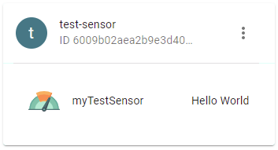

# Codecs

Check `GET /codecs` to list the available user-defined and internal codecs:

```json
[
    {
        "id":"application/json",
        "internal":true,
        "name":"JSON",
        "serveMime":"application/json",
        "mime":"application/octet-stream",
        "script":"<internal>"
    }, {
        "id":"application/x-xlpp",
        "internal":true,
        "name":"XLPP (Waziup Extended Low Power Payload)",
        "serveMime":"application/x-xlpp",
        "mime":"application/octet-stream",
        "script":"<internal>"
    }, {
        "id":"602bcc854b9f612d980ff7c7",
        "internal":false,
        "name":"My Codec",
        "serveMime":"",
        "mime":"application/javascript",
        "script":"…"
    },
    …
]
```

To assign a codec to a device, set the `codec` field in the device `meta` to the codec's `id`:

```js
// the XLPP codec has the id "application/x-xlpp" (see above).

fetch("/devices/6009b02aea2b9e3d40ff1128/meta", {
    method: "POST",
    body: JSON.stringify({
        codec: "application/x-xlpp"
    }),
    headers: {
        "Content-Type": "application/json"
    }
});
```

Now you can read and write the device using it's codec.

Set the request header `Accept: application/octet-stream` to signal the wazigate-edge that you want to
use the device codec to generate the response, or omit the `Accept` header.

```js
fetch("/devices/6009b02aea2b9e3d40ff1128", {
    method: "GET",
    headers: {
        "Accept": "application/octet-stream" // (optional)
    }
});

// the result will be raw binary XLPP data
```

To write a device using it's codec, use this snippet:

```js
fetch("/devices/6009b02aea2b9e3d40ff1128", {
    method: "POST",
    // body must be valid for the codec, e.g. for XLPP:
    body: new Uint8Array([5, 101, 4, 176, 6, 103, 0, 184]),
});
```

You can ignore the device codec and directly specify any available codec. The following snipped uses the JSON codec, no matter what codec is assigned to the device.

```js
fetch("/devices/6009b02aea2b9e3d40ff1128", {
    method: "POST",
    body: JSON.stringify({ … }),
    headers: {
        "Content-Type": "application/json"
    }
});
```

# Script Codecs

Script codecs are user-defined and run a single JavScript code that does the codec marshalling / unmarshalling.

To create a new codec, use `POST /codecs`:

```js
// A simple Decoder that reads the data as string and
// creates a 'myTestSensor' holding this string.
const script = `
function Decoder(bytes, port) {
  // Decode plain text; for testing only 
  return {
      myTestSensor: String.fromCharCode.apply(null, bytes)
  };
}`;

const resp = await fetch("/codecs", {
  method: "POST",
  body: JSON.stringify({
    name: "My test codec",
    mime: "application/javascript",
    script: script
  })
});
const id = await resp.text()
console.log("New codec id:", id);
```
The `mime` must be `application/javascript`.

No create a device having this codec, and upload some data:

```js
fetch("/devices/6009b02aea2b9e3d40ff1128", {
    method: "POST",
    body: new TextEncoder().encode("Hello World")
});
```

A new sensor has been created:



---------------------


To overide a codec, use `POST /codecs/{id}`:

```js
fetch("/codecs/602bcc854b9f612d980ff7c7", {
  method: "POST",
  body: JSON.stringify({
    name: "My test codec (v2)",
    mime: "application/javascript",
    script: "// your code here",
  })
});
```

---------------------


To delete a codec, use `DELETE /codecs/{id}`:

```js
fetch("/codecs/602bc61f4b9f612bf0d6969b", {
  method: "DELETE"
});
```

# Internal Codecs

Internal codecs are codecs that are already built into the Wazigate.

They have `mime: application/octet-stream` and the `ID` set to the `serveMime` type:

- `application/json` → JSON
- `application/x-xlpp` → XLPP
- `application/x-lpp` → XLPP
- `*/*` → JSON (default)


## JSON

```js
const resp = await fetch("/devices/6009b02aea2b9e3d40ff1128", {
    headers: {
        Accept: "application/json"
    }
});
const device = await resp.json()
console.log(device);
```
Expected output:

```json
{
    "actuators": [{
        "created":"2021-02-15T11:01:13.595Z",
        "id":"602a5479ea2b9e0dbce07ef2",
        "meta":{
            "quantity":"Color"
        },
        "modified":"2021-02-15T11:01:44.872Z",
        "name":"rgbLED",
        "time":"2021-02-15T11:02:21.099Z"
        ,"value":"#ff00aa"
    }],
    "created":"2021-01-21T16:47:38.434Z",
    "id":"6009b02aea2b9e3d40ff1128",
    "meta":{},
    "modified":"2021-01-21T16:47:38.434Z",
    "name":"test-sensor",
    "sensors":[]
}
```

---------------------


## XLPP Marshalling

1.  Update your actuator with meta `quantitiy` and `xlppChan` (required):

```js
fetch("/devices/6009b02aea2b9e3d40ff1128/actuators/602a5479ea2b9e0dbce07ef2/meta", {
    method: "POST",
    body: JSON.stringify({
        quantity: "Color",
        xlppChan: 2
    }),
    headers: {
        "Content-Type": "application/json"
    }
});
```

2.  Set an actuator value (required):
```js
fetch("/devices/6009b02aea2b9e3d40ff1128/actuators/602a5479ea2b9e0dbce07ef2/value", {
    method: "POST",
    body: JSON.stringify("#ff00aa"),
    headers: {
        "Content-Type": "application/json"
    }
});
```

3.  Check `devices/6009b02aea2b9e3d40ff1128/actuators/602a5479ea2b9e0dbce07ef2` in your browser (optional):
```json
{
    "created":"2021-02-15T10:28:40.668Z",
    "id":"602a4cd8ea2b9e35f4771d40",
    "meta":{
        "quantity":"Color",
        "xlppChan":1
    },
    "modified":"2021-02-15T10:59:34.203Z",
    "name":"RGBLED",
    "time":"2021-02-15T10:57:10.286Z",
    "value":"#ff00aa"
}
```

4. Retrieve XLPP data (XLPP Marshalling):

```js
const resp = await fetch("/devices/6009b02aea2b9e3d40ff1128", {
    headers: {
        Accept: "application/x-xlpp"
    }
});
const xlpp = await resp.arrayBuffer();
console.log(xlpp);
```
Expected output:
```
Uint8Array(13) [2, 135, 255, 0, 170]
```

Data        | Explanation
------------|----------------------------------------------------
2           | Channel, see actuator meta "xlppChan"
135         | XLPP Type Colour
255, 0, 170 | RGB Color bytes (#ff00aa), see actuator value

---------------------


## XLPP Unmarshalling

Encoding two sensors:

- Luminosity Sensor, Channel 5, Value: `1200 lux`
- Temperature Sensor, Channel 6, Value: `18.4 °C`

Run the following snippet in your browser:

```js
fetch("/devices/6009b02aea2b9e3d40ff1128", {
    method: "POST",
    body: new Uint8Array([5, 101, 4, 176, 6, 103, 0, 184]),
    headers: {
        "Content-Type": "application/x-xlpp"
    }
});
```

Data        | Explanation
------------|----------------------------------------------------
5           | 1. Sensor Channel
101         | XLPP Type Luminosity 
4, 176      | 1200 lux (2 bytes, 1 lux unsigned)
6           | 2. Sensor Channel
103         | XLPP Type Temperature 
0, 184      | 18.4 °C (2 bytes, 0.1°C signed)


Check your dashboard:


