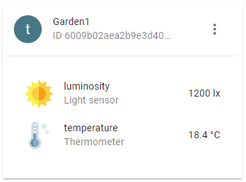

# Codecs

## Available Codecs

- `application/json` → JSON
- `application/x-xlpp` → XLPP
- `application/x-lpp` → XLPP
- `*/*` → JSON (default)


## JSON

```js
const resp = await fetch("/devices/6009b02aea2b9e3d40ff1128", {
    headers: {
        Accept: "application/json"
    }
});
const device = await resp.json()
console.log(device);
```
Expected output:

```json
{
    "actuators": [{
        "created":"2021-02-15T11:01:13.595Z",
        "id":"602a5479ea2b9e0dbce07ef2",
        "meta":{
            "quantity":"Color"
        },
        "modified":"2021-02-15T11:01:44.872Z",
        "name":"rgbLED",
        "time":"2021-02-15T11:02:21.099Z"
        ,"value":"#ff00aa"
    }],
    "created":"2021-01-21T16:47:38.434Z",
    "id":"6009b02aea2b9e3d40ff1128",
    "meta":{},
    "modified":"2021-01-21T16:47:38.434Z",
    "name":"test-sensor",
    "sensors":[]
}
```


## XLPP Marshalling

1.  Set `quantitiy` and `xlppChan` (required):

```js
fetch("/devices/6009b02aea2b9e3d40ff1128/actuators/602a5479ea2b9e0dbce07ef2/meta", {
    method: "POST",
    body: JSON.stringify({
        quantity: "Color",
        xlppChan: 2
    }),
    headers: {
        "Content-Type": "application/json"
    }
});
```

2.  Set value (required):
```js
fetch("/devices/6009b02aea2b9e3d40ff1128/actuators/602a5479ea2b9e0dbce07ef2/value", {
    method: "POST",
    body: JSON.stringify("#ff00aa"),
    headers: {
        "Content-Type": "application/json"
    }
});
```

3.  Check `devices/6009b02aea2b9e3d40ff1128/actuators/602a5479ea2b9e0dbce07ef2` in your browser (optional):
```json
{
    "created":"2021-02-15T10:28:40.668Z",
    "id":"602a4cd8ea2b9e35f4771d40",
    "meta":{
        "quantity":"Color",
        "xlppChan":1
    },
    "modified":"2021-02-15T10:59:34.203Z",
    "name":"RGBLED",
    "time":"2021-02-15T10:57:10.286Z",
    "value":"#ff00aa"
}
```

4. Retrieve XLPP data:

```js
const resp = await fetch("/devices/6009b02aea2b9e3d40ff1128", {
    headers: {
        Accept: "application/x-xlpp"
    }
});
const xlpp = await resp.arrayBuffer();
console.log(xlpp);
```
Expected output:
```
Uint8Array(13) [2, 135, 255, 0, 170]
```

Data        | Explanation
------------|----------------------------------------------------
2           | Channel, see actuator meta "xlppChan"
135         | XLPP Type Colour
255, 0, 170 | RGB Color bytes (#ff00aa), see actuator value


## XLPP Unmarshalling

Encoding two sensors:

- Luminosity Sensor, Channel 5, Value: `1200 lux`
- Temperature Sensor, Channel 6, Value: `18.4 °C`

Run the following snippet in your browser:

```js
fetch("/devices/6009b02aea2b9e3d40ff1128", {
    method: "POST",
    body: new Uint8Array([5, 101, 13, 141, 6, 103, 0, 184]),
    headers: {
        "Content-Type": "application/x-xlpp"
    }
});
```

Data        | Explanation
------------|----------------------------------------------------
5           | 1. Sensor Channel
101         | XLPP Type Luminosity 
4, 176      | 1200 lux (2 bytes, 1 lux unsigned)
6           | 2. Sensor Channel
103         | XLPP Type Temperature 
0, 184      | 18.4 °C (2 bytes, 0.1°C signed)


Check your dashboard:



